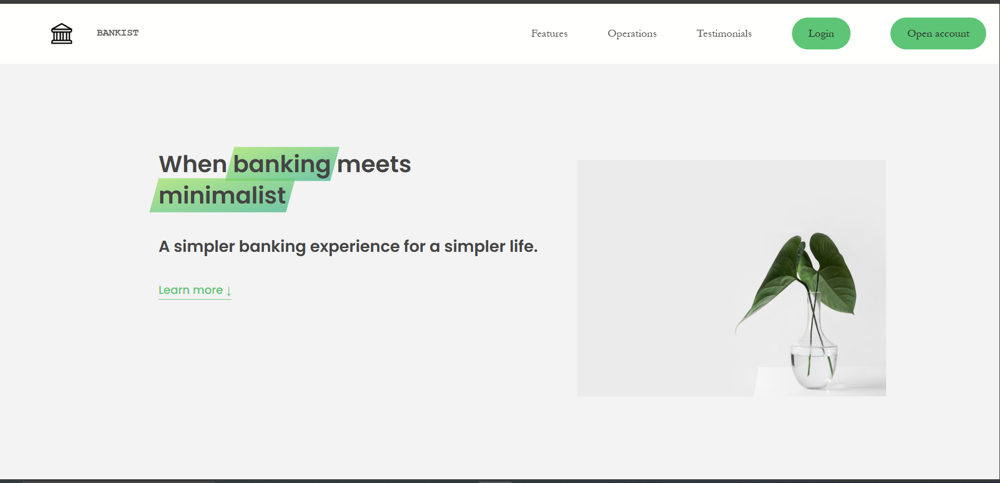
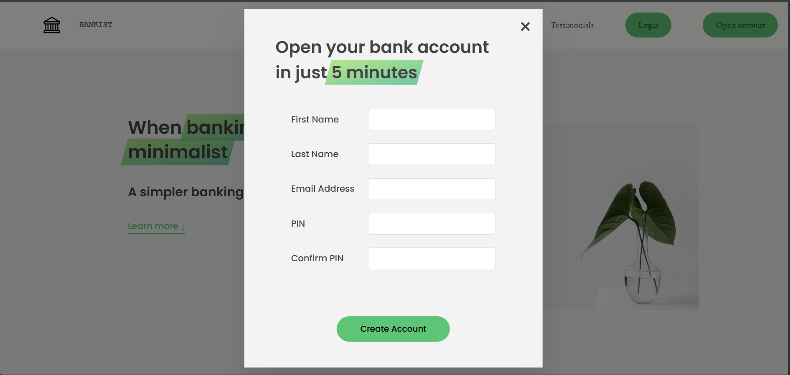
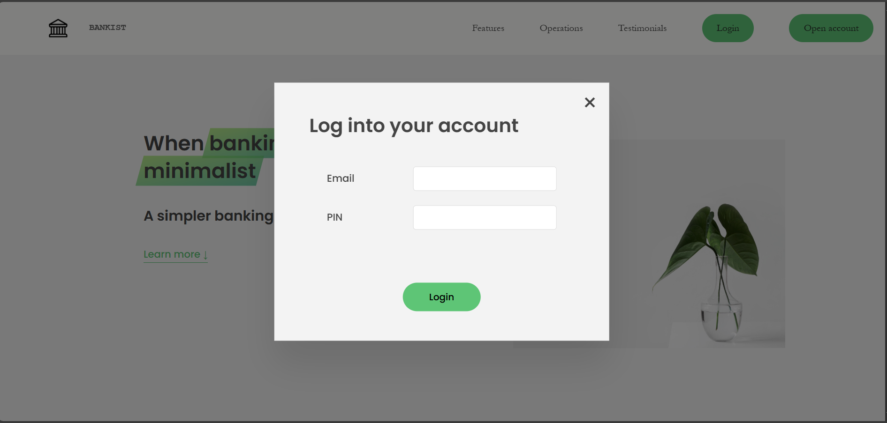
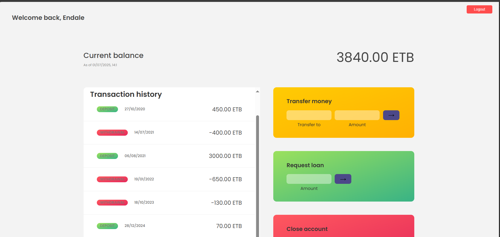

# 🏦 Virtual Banking Application
A modern, fully digital banking platform built with JavaScript, HTML, and CSS. Manage your finances, transfer money, request loans, and close your account—all from a beautiful, intuitive interface.

## 🚀 Features
- **100% Digital Bank:** Manage your accounts anytime, anywhere.
- **Instant Transfers:** Send money to anyone, instantly and securely.
- **Instant Loans:** Request and receive loans with a single click.
- **Account Closure:** Close your account instantly, no paperwork required.
- **Transaction History:** View all your deposits and withdrawals with dates.
- **Smart Summaries:** See your total balance, income, outgoings, and interest.
- **Multi-Currency Support:** Accounts can be in ETB, USD, or EUR.
- **Responsive UI:** Clean, modern design for desktop and mobile.

## 🖥️ Screenshots

### Home page


### Signup page


### Login Page


### Dashboard


## 🏗️ Project Structure
```text
Banking Application/
│
├── home.html                # Main banking dashboard
├── index.html               # Landing page with login/signup
├── src/
│   ├── scripts/
│   │   ├── dataModel.js     # Account data and structure
│   │   ├── home.js          # Banking dashboard logic
│   │   └── index.js         # Landing page, login, signup logic
│   └── styles/
│       ├── homeStyle.css    # Styles for dashboard
│       └── indexStyle.css   # Styles for landing page
├── img/                     # Images and icons
├── package.json             # Project metadata
└── README.md                # (You are here!)
```

## 📝 Account Data Structure
Each account is structured as follows (see `src/scripts/dataModel.js`):
```js
{
  owner: "Full Name",
  email: "user@example.com",
  movements: [200, -100, ...],         // Deposits (+) and withdrawals (-)
  interestRate: 1.2,                   // %
  pin: 1111,                           // Numeric PIN
  account: 123456,                     // Unique account number
  movementsDate: ["2024-06-22T10:30:17.380Z", ...], // ISO date strings
  currency: "ETB"                      // Currency code
}
```

## 🛠️ How to Run
1. **Clone the repository:**
   ```bash
   git clone <repo_URL>
   ```
2. **Install dependencies (if any):**
   > This project is pure JS/HTML/CSS and does not require npm packages for the frontend. If you add build tools, update this section.
3. **Open `index.html` in your browser.**
   - No server required! All data is stored in your browser's localStorage.

## 👤 User Guide
- **Sign Up:** Click "Open account" on the landing page, fill in your details, and start banking.
- **Login:** Use your email and PIN to access your dashboard.
- **Transfer Money:** Enter the recipient's account number and amount.
- **Request Loan:** Enter the amount and click the loan button.
- **Close Account:** Enter your email and PIN to close your account.
- **Logout:** Click the "Logout" button in the dashboard.

## ⚙️ Technical Details
- **Frontend:** Vanilla JavaScript, HTML5, CSS3
- **State Management:** Browser localStorage (no backend)
- **Persistence:** All user data is stored in the browser. Clearing browser storage will remove all accounts and transactions.

## 📦 Extending the App
- Add backend integration for real-world use.
- Implement email verification and password reset.
- Add more currencies and localization.
- Improve accessibility and mobile responsiveness.

## 📝 License
MIT License

---
**Created by Endale Tegegnework**  
_This is a demo banking application. Do not use for real financial transactions!_